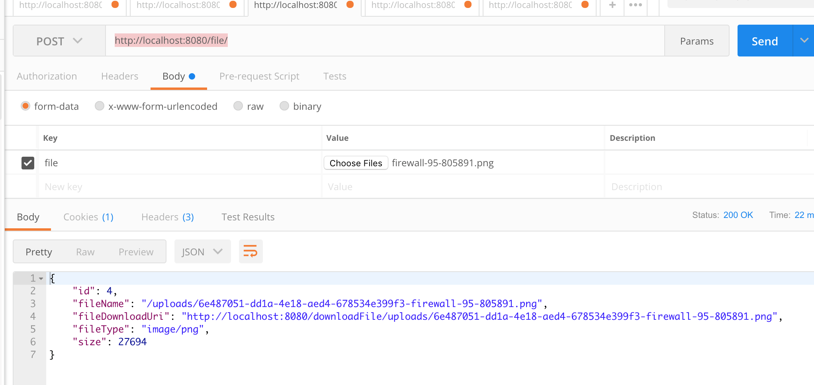
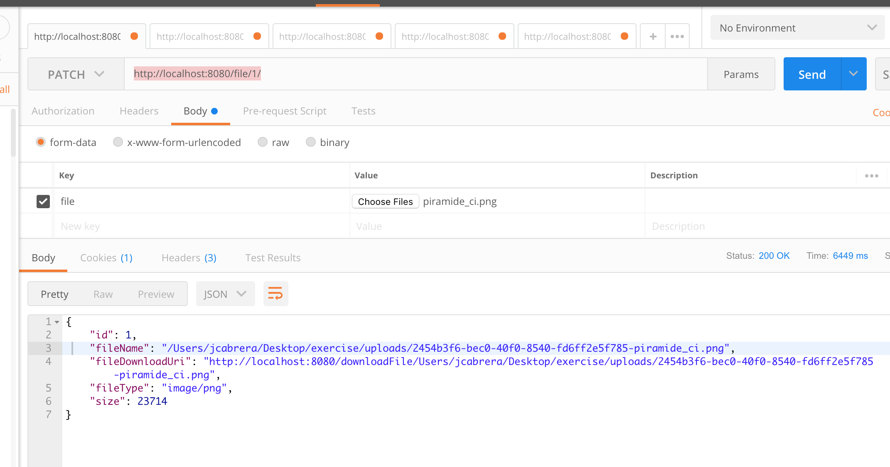
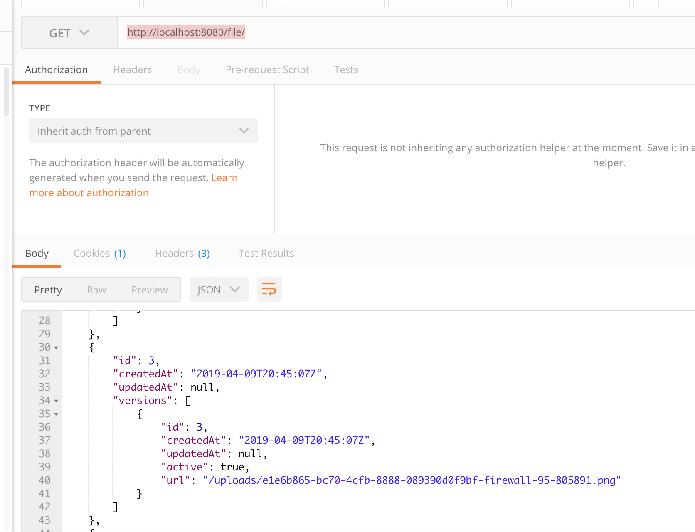
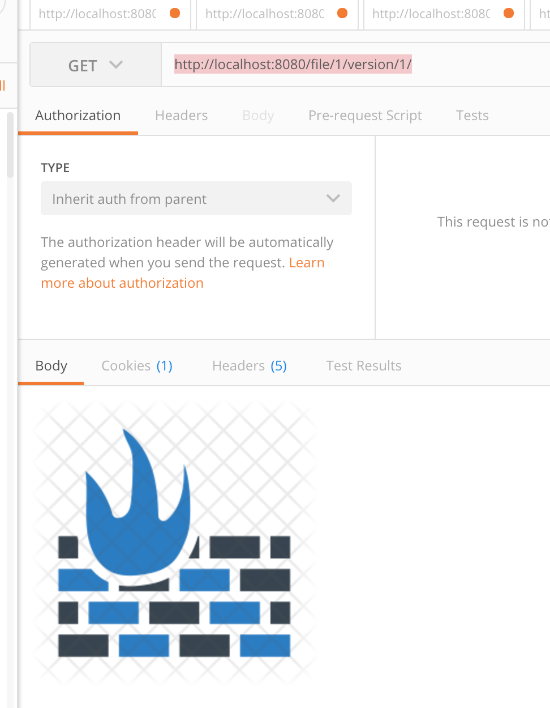

# Exercise
Simple file storage using mysql, docker and spring boot

##setup
This requires docker, java8 and gradlew. 


To run locally, execute: 

```
./run.sh

```
This will execute the app build (includes tests using an h2 db, and code checks pmd and checkstyle), then it will
build the compose file and start it, on windows run the commands of the script (run.sh) according to environment.


to stop the app, run :

```
docker-compose down
```

To generate coverage Report

```

 ./gradlew build jacocoTestReport

```

##Use of api

###Create
Execute a post to :

http://localhost:8080/file/



###Create a new version:
Execute a POST to : 

http://localhost:8080/file/{fileId}/



###List files and versions:
Execute a GET to http://localhost:8080/file/



###Get a File
Execute a GET to 

http://localhost:8080/file/{fileId}/

or if you need an specific version:

http://localhost:8080/file/{fileId}/version/{version}/



###Delete a File
Execute a DELETE to 
http://localhost:8080/file/1/

##TO-DO
* Add test increase coverage to around 80%, only basic functionality is cover as it's a 'demo'
* Add int test to cover api contract
* Service still needs some refactor
* Test are leaving trash on app dir
* CI on TravisCI with a hook on github for PRs will be great
* Including Swagger can be nice
* build it's not failing if gradlew fails, it should


